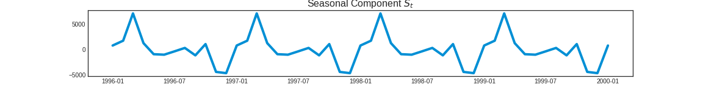
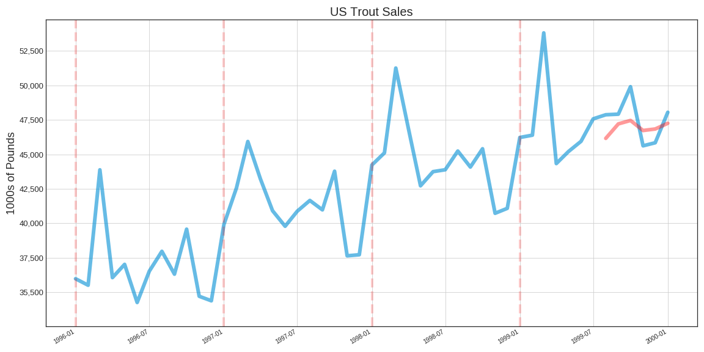
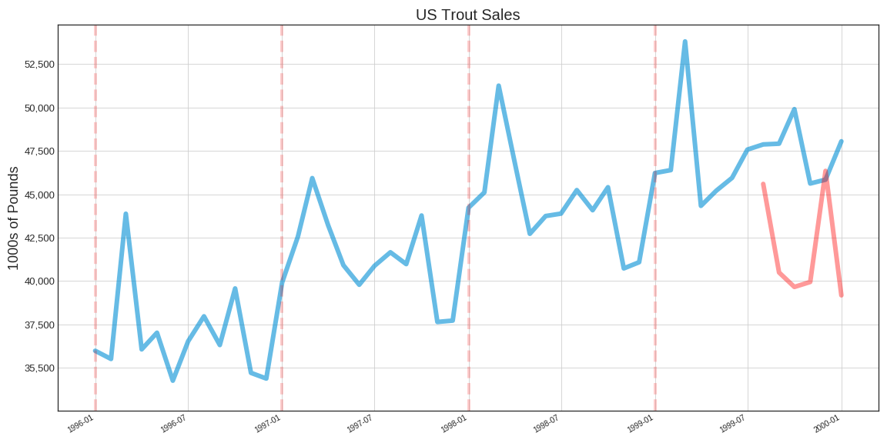
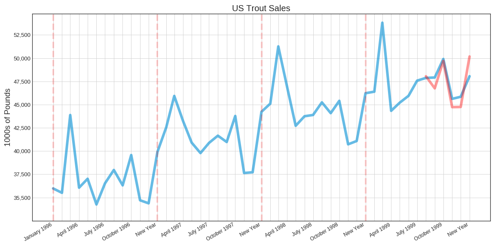
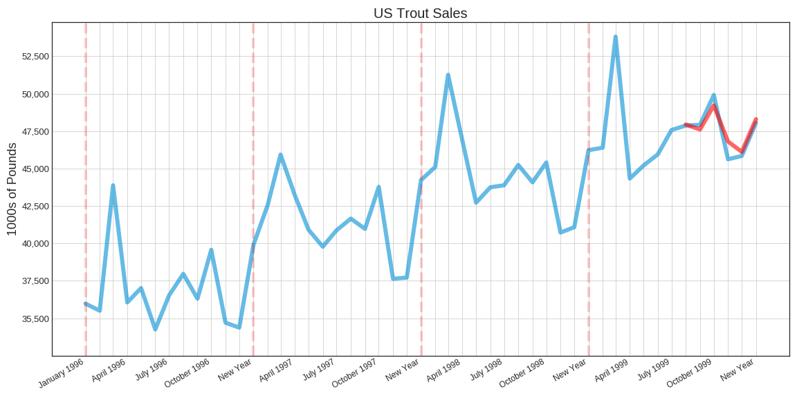

# Trout Sales Prediction  
# Anton Korolev
[LinkedIn](https://www.https://www.linkedin.com/in/anton-korolevb558/) | [GitHub](https://https://www.github.com/VHTATAH)
## Table of Contents
1. [Overview](#Overview)
2. [Data](#Data)
3. [Visualization of Dataset](#Visualization%20of%20Dataset)
4. [Decomposition](#Decomposition:) 
5. [Recurrent Neural Network Model](#Recurrent%20Neural%20Network%20Model:) 
6. [Long Short Term Memory (LSTM) Model](#Long%20Short%20Term%20Memory%20(LSTM)%20Model:)
7. [Exponential Smoothing for Time Series Forecasting Model (ETS)](#Exponential%20Smoothing%20for%20Time%20Series%20Forecasting%20Model%20(ETS):)
8. [Auto Regressive Integrated Moving Average (ARIMA) Model](#Auto%20Regressive%20Integrated%20Moving%20Average%20(ARIMA) Model)
---
## Overview
Aquaculture, or the production of fish, shellfish, and aquatic plants in a controlled environment, is the fastest growing segment of agriculture in America.

As consumer demand has grown, so has the aquaculture industry; farm-raised fish and shellfish now account for over 40% of all the fish and shellfish eaten around the world.

The vast majority of U.S. trout grown commercially for food are grown in Idaho, which accounts for over 75% of the production. It’s no secret that Idaho’s success is linked to a vast system of aquifers and springs. However, water of high purity and cold temperatures are found elsewhere in our country, giving rise to an industry that is truly national in scope. Other leading states include Pennsylvania, North Carolina, Washington, and California. Follow this link to the 2008 USDA Trout Production Report for more information.

In 2008, over 53 million pounds of trout, mostly rainbow trout, were grown in the U.S., primarily for the food fish market. Substantial numbers are also grown for recreational use.

Trout for the food fish market are sold fresh or frozen to restaurants, supermarkets and institutions. The process/packaging phase of the industry is highly sophisticated. Trout are marketed as dressed or boned and boneless fillets. They may be breaded or stuffed. Trout also available canned, like tuna or salmon, as pate or smoked product. It is not unusual for trout to be harvested, processed, chilled and packaged for shipment in less than 90 minutes!

## **Data**
Data was downloaded from https://www.nass.usda.gov 

## **Visualization of Dataset** 

## **Decomposition:**

## **Recurrent Neural Network Model:**

## **Long Short Term Memory (LSTM) Model:**

## **Exponential Smoothing for Time Series Forecasting Model (ETS):**

## **Auto Regressive Integrated Moving Average (ARIMA) Model:**

