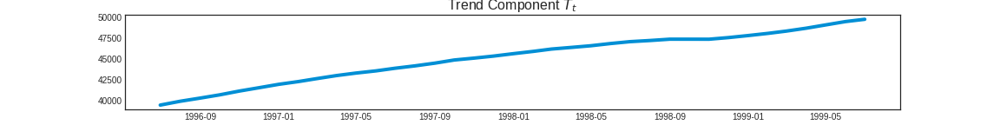
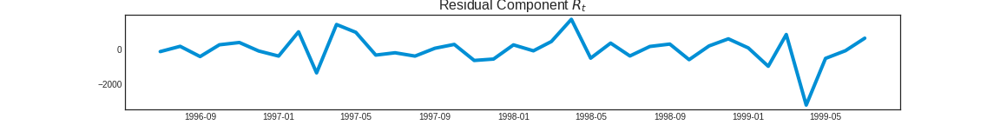

# Trout Sales Prediction  
# Anton Korolev
[LinkedIn](https://www.https://www.linkedin.com/in/anton-korolevb558/) | [GitHub](https://https://www.github.com/VHTATAH)
## Table of Contents
1. [Overview](#Overview)
2. [Data](#Data)
3. [Visualization of Dataset](#Visualization%20of%20Dataset)
4. [Logistic Regression](#Logistic%20Regression) 
5. [Random Forest](#Random%20Forest) 
6. [Gradient Boosting](#Gradient%20Boosting)
---
## Overview
**Federal Aviation Administration** estimated that flight delays cost the airline industry $8 billion a year, much of it due to increased spending on crews, fuel and maintenance. Delays cost passengers even more - nearly $17 billion.

In this project I used machine Learning techniques to predict flight arrival delays for Boston Logan Airport. Various prediction models were developed and evaluated. Data was visually represented using graphs and charts.

## **Data**
Data was downloaded from https://www.nass.usda.gov 

## **Visualization of Dataset** 

## **Decomposition:**

## **Recurrent Neural Network Model:**

## **Long Short-Term Memory (LSTM) Model:**

## **Exponential Smoothing for Time Series Forecasting Model (ETS):**

## **Auto Regressive Integrated Moving Average (ARIMA) Model:**

